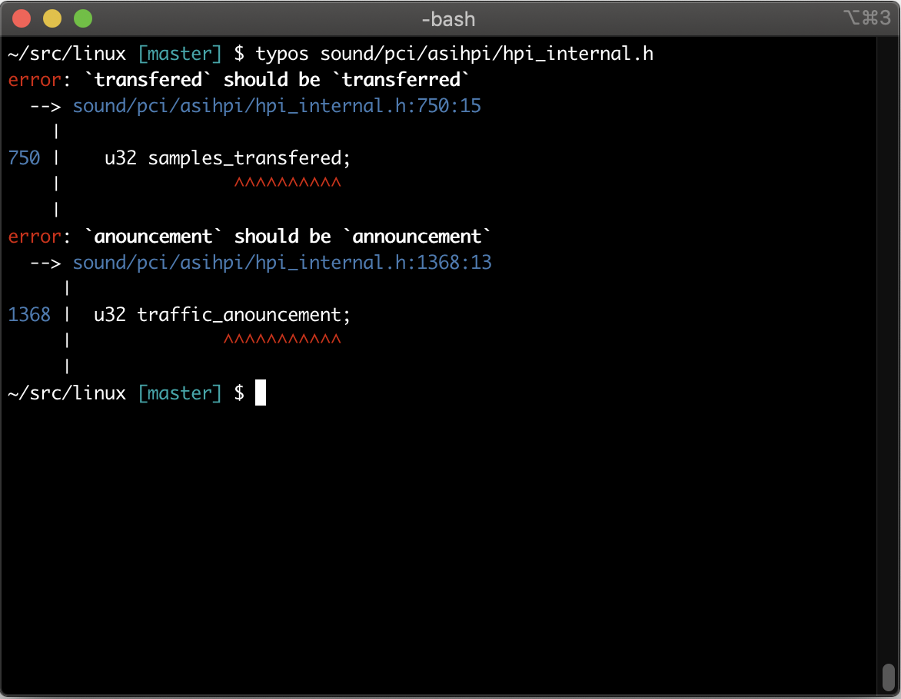

# typos

> **Source code spell checker**

Finds and corrects spelling mistakes among source code:
- Fast enough to run on monorepos
- Low false positives so you can run on PRs



[](https://codecov.io/gh/crate-ci/typos)
[][Documentation]

[][Crates.io]

Dual-licensed under [MIT](LICENSE-MIT) or [Apache 2.0](LICENSE-APACHE)

## Documentation

- [Installation](#install)
- [Getting Started](#getting-started)
  - [False Positives](#false-positives)
  - [Integrations](#integrations)
    - [GitHub Action](docs/github-action.md)
    - [pre-commit](docs/pre-commit.md)
    - [Custom](#custom)
  - [Debugging](#debugging)
- [Reference](docs/reference.md)
- [FAQ](#faq)
- [Comparison with other spell checkers](docs/comparison.md)
- [Projects using typos](https://github.com/crate-ci/typos/wiki)
- [Benchmarks](benchsuite/runs)
- [Design](docs/design.md)
- [Contribute](CONTRIBUTING.md)
- [CHANGELOG](CHANGELOG.md)

## Install

[Download](https://github.com/crate-ci/typos/releases) a pre-built binary
(installable via [gh-install](https://github.com/crate-ci/gh-install)).

Or use rust to install:
```bash
cargo install typos-cli
```

Or use [Homebrew](https://brew.sh/) to install:
```bash
brew install typos-cli
```

Or use [Conda](https://conda.io/) to install:
```bash
conda install typos
```

Or use [Pacman](https://wiki.archlinux.org/title/pacman) to install:
```
sudo pacman -S typos
```

## Getting Started

Most commonly, you'll either want to see what typos are available with
```bash
typos
```

Or have them fixed
```bash
typos --write-changes
typos -w
```
If there is any ambiguity (multiple possible corrections), `typos` will just report it to the user and move on.

### False-positives

Sometimes, what looks like a typo is intentional, like with people's names, acronyms, or localized content.

To mark a word or an identifier (grouping of words) as valid, add it your [`_typos.toml`](docs/reference.md) by declaring itself as the valid spelling:
```toml
[default]
extend-ignore-identifiers-re = [
    # *sigh* this just isn't worth the cost of fixing
    "AttributeID.*Supress.*",
]

[default.extend-identifiers]
# *sigh* this just isn't worth the cost of fixing
AttributeIDSupressMenu = "AttributeIDSupressMenu"

[default.extend-words]
# Don't correct the surname "Teh"
teh = "teh"
```

For cases like localized content, you can disable spell checking of file contents while still checking the file name:
```toml
[type.po]
extend-glob = ["*.po"]
check-file = false
```
(run `typos --type-list` to see configured file types)

If you need some more flexibility, you can completely exclude some files from consideration:
```toml
[files]
extend-exclude = ["localized/*.po"]
```

### Integrations

- [GitHub Actions](docs/github-action.md)
- [pre-commit](docs/pre-commit.md)
- [🐊Putout Processor](https://github.com/putoutjs/putout-processor-typos)
- [Visual Studio Code](https://github.com/tekumara/typos-vscode)
- [typos-lsp (Language Server Protocol server)](https://github.com/tekumara/typos-vscode)

#### Custom

`typos` provides several building blocks for custom native integrations
- `-` reads from `stdin`, `--write-changes` will be written to `stdout`
- `--diff` to provide a diff
- `--format json` to get jsonlines with exit code 0 on no errors, code 2 on typos, anything else is an error.

Examples:
```bash
# Read file from stdin, write corrected version to stdout
typos - --write-changes
# Creates a diff of what would change
typos dir/file --diff
# Fully programmatic control
typos dir/file --format json
```

### Debugging

You can see what the effective config looks like by running
```bash
typos --dump-config -
```

You can then see how typos is processing your project with
```bash
typos --files
typos --identifiers
typos --words
```

If you need to dig in more, you can enable debug logging with `-v`

## FAQ

### Why was ... not corrected?

**Does the file show up in `typos --files`?**
If not, check your config with `typos --dump-config -`.
The `[files]` table controls how we walk files.
If you are using `files.extend-exclude`,
are you running into [#593](https://github.com/crate-ci/typos/issues/593)?
If you are using `files.ignore-vcs = true`,
is the file in your `.gitignore` but git tracks it anyways?
Prefer allowing the file explicitly (see [#909](https://github.com/crate-ci/typos/issues/909)).

**Does the identifier show up in `typos --identifiers` or the word show up in `typos --words`?**
If not, it might be subject to one of typos' heuristics for
detecting non-words (like hashes) or
unambiguous words (like words after a `\` escape).

If it is showing up, likely `typos` doesn't know about it yet.

`typos` maintains a list of known typo corrections to keep the false positive
count low so it can safely run unassisted.

This is in contrast to most spell checking UIs people use where there is a
known list of valid words.  In this case, the spell checker tries to guess your
intent by finding the closest-looking word.  It then has a gauge for when a
word isn't close enough and assumes you know best.  The user has the
opportunity to verify these corrections and explicitly allow or reject them.

For more on the trade offs of these approaches, see [Design](docs/design.md).

- To correct it locally, see also our [False Positives documentation](#false-positives).
- To contribute your correction, see [Contribute](CONTRIBUTING.md)

[Crates.io]: https://crates.io/crates/typos-cli
[Documentation]: https://docs.rs/typos
