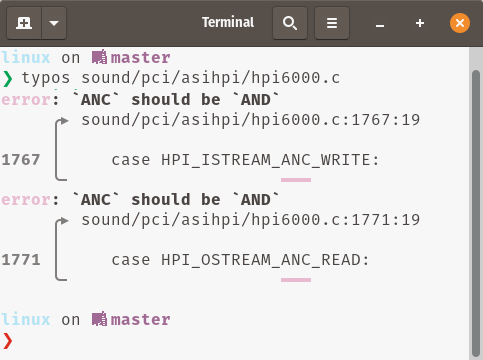

# typos

> **Source code spell checker**

Finds and corrects spelling mistakes among source code:
- Fast enough to run on monorepos
- Low false positives so you can run on PRs



[](https://dev.azure.com/crate-ci/crate-ci/_build/latest?definitionId=11&branchName=master)
[](https://codecov.io/gh/crate-ci/typos)
[][Documentation]

[](https://crates.io/crates/typos)

Dual-licensed under [MIT](LICENSE-MIT) or [Apache 2.0](LICENSE-APACHE)

## Documentation

- [Installation](#install)
- [Getting Started](#getting-started)
- [Reference](docs/reference.md)
- [Comparison with other spell checkers](docs/comparison.md)
- [Benchmarks](benchsuite/runs)
- [Design](docs/design.md)
- [Contribute](CONTRIBUTING.md)
- [CHANGELOG](CHANGELOG.md)

## Install

[Download](https://github.com/crate-ci/typos/releases) a pre-built binary
(installable via [gh-install](https://github.com/crate-ci/gh-install)).

Or use rust to install:
```bash
cargo install typos-cli
```

## Getting Started

Most commonly, you'll either want to see what typos are available with
```bash
typos
```

Or have them fixed
```bash
typos --write-changes
typos -w
```
If there is any ambiguity (multiple possible corrections), `typos` will just report it to the user and move on.

### False-positives

Sometimes, what looks like a typo is intentional, like with people's names, acronyms, or localized content.

To mark an identifier or word as valid, add it your [`_typos.toml`](docs/reference.md) by declaring itself as the valid spelling:
```toml
[default.extend-identifiers]
# *sigh* this just isn't worth the cost of fixing
AttributeIDSupressMenu = "AttributeIDSupressMenu"

[default.extend-words]
# Don't correct the surname "Teh"
teh = "teh"
```

For localized content, you might want to exclude the entire file
```toml
[files]
extend-exclude = ["localized/*.po"]
```

### Integrations

`typos` provides several building blocks for custom integrations
- `-` reads from `stdin`, `--write-changes` will be written to `stdout`
- `--diff` to provide a diff
- `--format json` to get jsonlines with exit code 0 on no errors, code 2 on typos, anything else is an error.

Examples:
```bash
# Read file from stdin, write corrected version to stdout
typos - --write-changes
# Creates a diff of what would change
typos dir/file --diff
# Fully programmatic control
typos dir/file --format json
```

[Crates.io]: https://crates.io/crates/typos-cli
[Documentation]: https://docs.rs/typos
